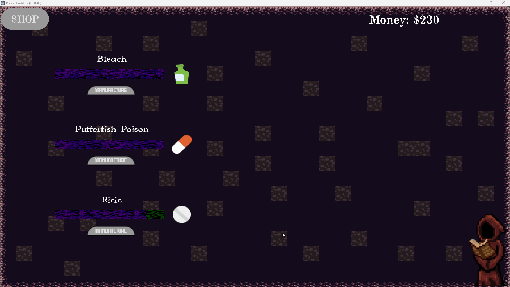

# 🍎 Cider Game Development 🍎

Hi, I'm Jonah Lukin. A game developer/software engineer passionate about all things game dev 🎮.

# 🔑 Links

[Conquering Ciros (Lead Engineer/Programmer & Systems + UI Engineer/Programmer)](https://store.steampowered.com/app/2818530/Conquering_Ciros/)

[Portfolio/Resume](https://www.jonahlukin.com)

[LinkedIn](https://www.linkedin.com/in/jonah-lukin/) 

# 🌟 Major Projects

### *Conquering Ciros* | [AVAILABLE ON STEAM NOW!!!](https://store.steampowered.com/app/2818530/Conquering_Ciros/)
A Vampire Survivors-like game with a strategic twist. Use the power of crystals to reclaim your fallen kingdom!

- Lead Engineer/Programmer
- Systems + UI Engineer/Programmer
- Lead UI/UX Designer

###### Made in Unity - Written in C#

### [*Computer Graphics Final*](https://github.com/jblukin/Computer-Graphics-Final)
A graphics rendering project using basic techniques primarily coded using HLSL and the GPU

- Fragment + Vertex Shaders
- Ambient + Diffuse + Specular Lighting
- Vertex Displacement
- Texture Mapping

###### Made in Unity - Written in HLSL (and C#)

# 🧩 Other Projects and Demos

### [*Billionaire*](https://github.com/jblukin/B453-LectureProject)
A tower defense game developed to improve skills for common game development topics

- Singletons
- Coroutines
- Events
- Collisions
- Raycasts
- etc...

###### Made in Unity - Written in C#

### [*GPU Spline Renderer*](https://github.com/jblukin/B481jlukin/tree/main/problem-sets/ps03/Problem-Set-03-jlukin)
A graphics rendering project using the GPU to generate and render a spline as one of the 3 main types (Bezier, Catmull-Rom, and B-Splines)  

###### Made in Unity - Written in HLSL (and C#)

### [*Port-a-Project*](https://github.com/jblukin/Port-a-Project-B453/tree/main)
A CC0 game jam beat'em up game found on Itch.io ported from GameMaker to Unity  

###### Made in Unity - Written in C#

### [*Pull-it Puzzles*](https://github.com/jblukin/C292-Fall2021/tree/master/Midterm%20Project)
A small 2D Puzzle Platform designed and programmed entirely by me  

###### Made in Unity - Written in C#

### [*Erebus' Elegy*](https://github.com/jblukin/ErebusElegy)
A prototype of a 3D horde survival game where strategic movement is key to victory  

###### Made in Unity - Written in C#

### [*3D Unity Tutorial Project*](https://github.com/jblukin/C292-Fall2021/tree/master/3D%20Tutorial)
An introductory project to 3D in Unity including dialogue, basic movement, lighting, and other basic gameplay systems  

###### Made in Unity - Written in C#

### [*Poison Profiteer*](https://github.com/jblukin/C220-Final-Project-Poison)
A small idle game about selling types of poisons  

###### Made in Godot 3 - Written in GDScript

### [*2D Space Shooter*](https://github.com/jblukin/02-Space-Shooter)
A simple 2D Asteroids-like demo game  

###### Made in Godot 3 - Written in GDScript

### [*Juicy Match-3*](https://github.com/jblukin/03-Juicy-Match-3)
A small match-3 game focusing on techniques to add "juice" like screen shake to games  

###### Made in Godot 3 - Written in GDScript

### [*FPS Maze*](https://github.com/jblukin/05-FPS-Maze)
A small fps maze demo with obstacles, enemies, and weapons  

###### Made in Godot 3 - Written in GDScript

<!-- PROJECT TEMPLATE -->
<!--

### [*NAME OF PROJECT*](LINK TO REPOSITORY)
SHORT DESCRIPTION  

###### Made in GAME ENGINE - Written in CODE LANGAUGE

-->
